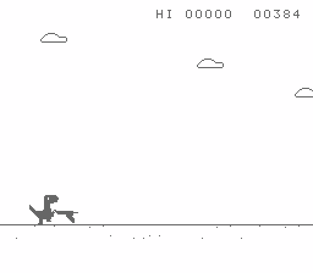

# Dino

The Chrome no-internet dinosaur game, written for the NES.



It is a plain NROM cartridge, so it runs on any NES and on any emulator.

## Playing

| | |
|---|---|
| Jump | **A**, or **Up** |
| Duck | **Down** |
| Drop out of a jump | **Down**, while in the air |
| Start, and start again | **A**, **Up** or **Start** |

A tapped jump and a held one are different heights, which is most of the
timing in the game.

Cacti come small and large, singly and in groups. Pterodactyls turn up once
you are into the hundreds and fly at three heights: the low one has to be
jumped, the middle one ducked, and the high one you can run straight under.
It speeds up for the first couple of minutes, the score flashes every hundred
points, and every seventh hundred turns day into night.

## Building

Needs [cc65](https://cc65.github.io) and Lua.

```sh
brew install cc65 lua      # or your package manager's equivalent
make                       # -> build/dino.nes
make run                   # build it and play it
make test                  # build it and check it still works
```

`make run` and `make test` use [MyNES](https://github.com/dimiro1/mynes),
which the build finds by itself: `$MYNES` if you set it, otherwise one lying
about near the project, otherwise it asks, otherwise it downloads a release.

## The artwork

Every graphic is drawn by hand as text in `assets/*.tiles`, one character to a
pixel. That is the real thing — the tile data the cartridge holds is generated
from it:

```
@sprite CACTUS_SMALL $50 1x2
..ooo...       .  the backdrop
..ooo...       o  the ink colour
o.ooo...
o.ooo.o.
o.ooo.o.
ooooo.o.
..ooooo.
..ooo...
```

Edit the text and run `make art`. It also draws everything into
`assets/preview/` so you can see what you have without starting the game.

## Layout

```
assets/        the artwork, as text, plus pictures of it
src/           the game, in 6502 assembly
tools/         the art compiler, the tests, and finding an emulator
```

The assembly is commented; start at `src/main.s`.
