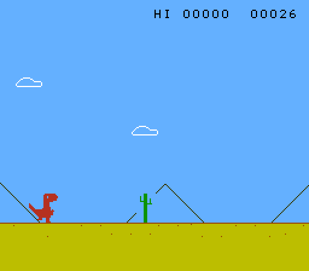
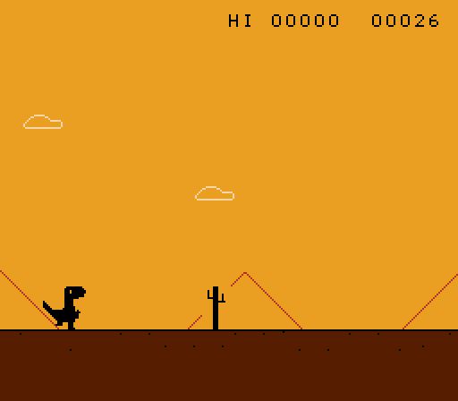
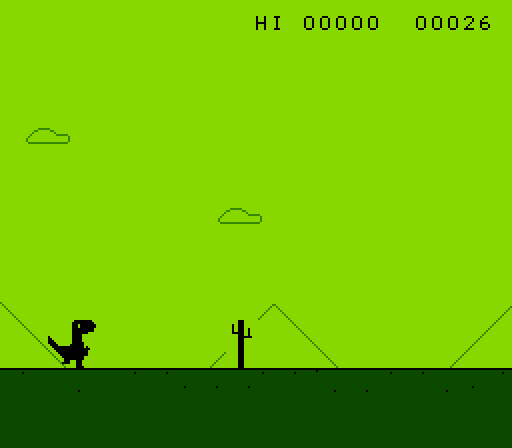

# Dino

The Chrome no-internet dinosaur game, written for the NES.


It is a plain NROM cartridge, so it runs on any NES and on any emulator.

## Download

Grab `dino.nes` from the [releases page](https://github.com/dimiro1/nes-dino/releases)
and open it in any emulator. Nothing else to install.

## Playing

| | |
|---|---|
| Jump | **A**, or **Up** |
| Duck | **Down** |
| Drop out of a jump | **Down**, while in the air |
| Start, and start again | **A**, **Up** or **Start** |
| Change the colours | **Select** |

A tapped jump and a held one are different heights, which is most of the
timing in the game.

Cacti come small and large, singly and in groups. Pterodactyls turn up once
you are into the hundreds and fly at three heights: the low one has to be
jumped, the middle one ducked, and the high one you can run straight under.
It speeds up for the first couple of minutes, the score flashes every hundred
points, and every seventh hundred turns day into night.

## Colours

It starts in CLASSIC, which is the browser's picture: a grey dino on a white
page. **Select** walks through three colour schemes and back round again, and
the title screen names whichever one you are on. Your choice sticks across a
game over, and each scheme has a night of its own for when the lights go out.

| DESERT | SUNSET | POCKET |
|---|---|---|
|  |  |  |

A scheme is nine colours, and the thirty-two bytes the PPU wants are built
back up from them -- see `scheme_table` in `src/data.s`. Every tile is a
single ink on a transparent backdrop, and colour 0 is the sky in every
palette, so which palette a tile gets only has to follow the band of the
screen it is in and never has to follow the scroll. That is why the attribute
tables are written once at the start and never touched again, and why a new
column of world still carries tiles and nothing else.

The range along the horizon is drawn in colour 2, which no other tile uses,
so it costs no attribute byte of its own. In CLASSIC it is a faint grey
outline; the ground band below the line is the same trick, and is set to the
sky colour there so that it disappears.

## Building

Needs [cc65](https://cc65.github.io) and Lua.

```sh
brew install cc65 lua      # or your package manager's equivalent
make                       # -> build/dino.nes
make run                   # build it and play it
make test                  # build it and check it still works
```

`make run` and `make test` use [MyNES](https://github.com/dimiro1/mynes),
which the build finds by itself: `$MYNES` if you set it, otherwise one lying
about near the project, otherwise it asks, otherwise it downloads a release.

## The artwork

Every graphic is drawn by hand as text in `assets/*.tiles`, one character to a
pixel. That is the real thing — the tile data the cartridge holds is generated
from it:

```
@sprite CACTUS_SMALL $50 1x2
##ooo###       .  the backdrop, which is the sky
##ooo###       o  the ink
o#ooo###       #  the second ink, which only the ground and the
o#ooo#o#          distant strip a cactus stands in ever use
o#ooo#o#
ooooo#o#
##ooooo#
##ooo###
```

Four characters, because a tile is four colours and the NES will only give you
that. Nearly everything is drawn in one of them on a transparent backdrop; the
second ink is what buys the ground band and the mountains their own colour
without spending an attribute byte on either.

Edit the text and run `make art`. It also draws everything into
`assets/preview/` so you can see what you have without starting the game.

## Layout

```
assets/        the artwork, as text, plus pictures of it
src/           the game, in 6502 assembly
tools/         the art compiler, the tests, and finding an emulator
```

The assembly is commented; start at `src/main.s`.
